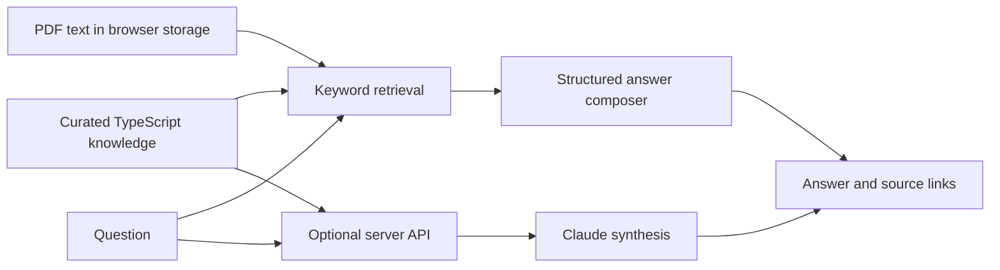

# Archestraide

A retrieval-based support assistant for **AVEVA Application Server, OMI and System Platform**. It turns a curated knowledge base into cited explanations and troubleshooting checklists, with local PDF search and optional Claude synthesis.

The interface is in Spanish, keeping AVEVA product names and technical terms in English.

## What it does

Engineers learning an industrial software stack often need to connect an error message to the right concept, diagnostic tool and documentation. Archestraide brings those references into one small web application:

- Ask technical questions and get structured answers with source links.
- Follow a troubleshooting checklist scoped by symptom, environment and trigger.
- Browse runbooks, a glossary and known issues.
- Import text-based PDFs into the browser for use in Ask and document search.
- Read community troubleshooting contributions stored as GitHub Issues; submissions open a prefilled issue for the user to publish.

## How it works



`lib/retrieval.ts` ranks passages using term frequency, inverse document frequency, phrase matches, title matches and intent weighting. It does not use embeddings or a vector database. The answer composer selects the matching runbook, glossary entry, known issue or uploaded passage.

The optional `/api/ask` route sends the question and retrieved **bundled** content to Claude to rewrite the short answer. With uploaded manuals present, Ask stays in the browser. Citations and confidence labels come from retrieval; they do not independently verify generated text.

The guided troubleshooting wizard uses predefined runbooks. Uploaded PDFs extend Ask and Docs search, not the wizard. Community issues are displayed separately and are not indexed into answers.

## Run locally

Use Node.js 22 and npm. The lockfile records the dependency versions.

```bash
git clone https://github.com/javronich1/archestraide.git
cd archestraide/archestraide
npm ci
npm run dev
```

Open `http://localhost:3000`. No API key is needed for the default answer composer.

For optional synthesis, copy `.env.example` to `.env.local` and set `ANTHROPIC_API_KEY` on your local machine. `ARCHESTRAIDE_MODEL` controls the model. Keep the key server-side.

```bash
npm test
npm run typecheck
npm run build
npm start
```

## Static deployment

The included Netlify configuration builds a static site:

```bash
npm run build:static
```

The output is `archestraide/out/` relative to the repository root. The build temporarily moves the API route out of the application and restores it afterwards. The static site uses browser-based answers and has **no Claude endpoint**; setting an API key on a static host does not enable synthesis.

The GitHub Pages workflow is manually triggered. It supplies `BASE_PATH` for a project URL. Deployment details and current security limitations are in the [development notes](archestraide/README.md).

## Repository structure

```text
archestraide/
  app/                 Pages and optional /api/ask endpoint
  components/          Answer, source and navigation components
  lib/knowledge/       Curated runbooks, concepts, issues and source registry
  lib/retrieval.ts      Passage ranking
  lib/answer.ts         Structured answer composition
  lib/userKnowledge.ts Browser PDF ingestion and storage
  lib/community.ts     GitHub Issues integration
  scripts/             Static build helper
  tests/               Retrieval, source and chunking regression tests
netlify.toml           Static hosting configuration
.github/workflows/     Optional GitHub Pages deployment
```

**Stack:** Next.js, React, TypeScript, Tailwind CSS, PDF.js and the optional Anthropic API.

## Scope and data handling

This is an independent project by Gonzalo Fernandez de Cordoba, based on public AVEVA documentation and linked vendor technical notes. It is not an official AVEVA product. No vendor manuals, industrial datasets or customer configurations are bundled.

Uploaded text is stored in this browser's `localStorage`; clearing site data removes it. PDF.js loads a worker from jsDelivr. Community contributions are public GitHub Issues. The optional server mode sends questions and retrieved bundled passages to Anthropic.

The knowledge base is a limited, manually curated snapshot. It does not crawl current documentation, connect to industrial systems, execute changes or validate plant state. Retrieval confidence is a heuristic, not a calibrated measure of correctness. Scanned PDFs need OCR, which is not implemented, and large manuals can exceed browser storage limits.

See [knowledge ingestion](archestraide/docs/INGESTION.md) to extend the corpus. Linked third-party documentation remains subject to its owners' terms; no repository-wide license has been assigned.
